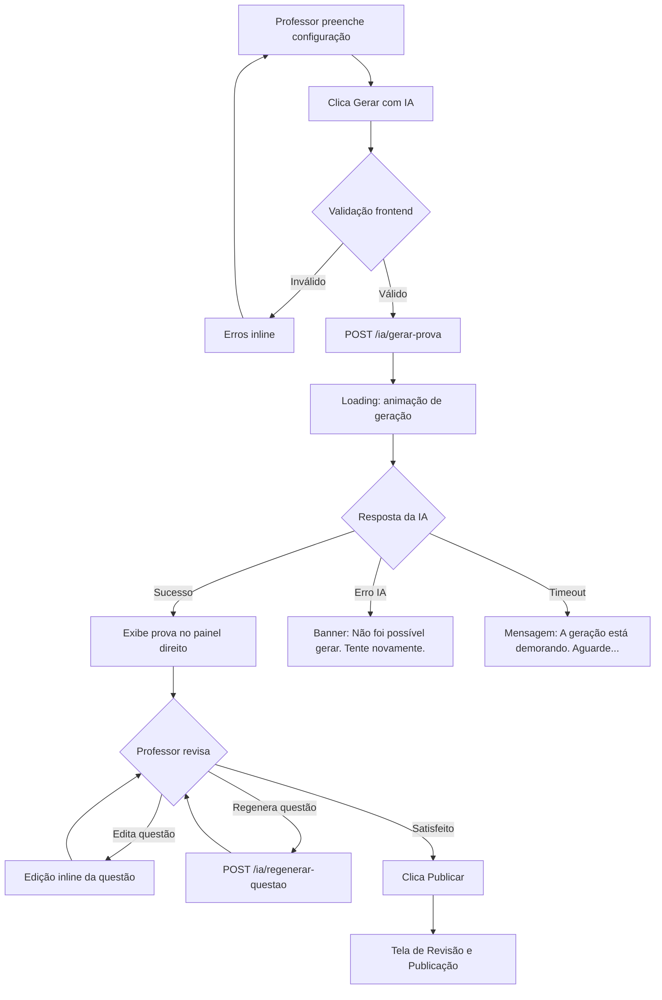

# Spec 02b — Área do Professor: Criação com IA

> **Macro funcionalidade:** Geração de provas, atividades, grades de aula e sugestão de conteúdos via IA  
> **Perfis envolvidos:** Professor  
> **Plataforma:** Web (desktop-first)

---

## Telas desta Spec

1. [Hub de Criação com IA](#tela-hub-de-criação)
2. [Gerador de Provas](#tela-gerador-de-provas)
3. [Gerador de Atividades](#tela-gerador-de-atividades)
4. [Gerador de Grade de Aulas](#tela-gerador-de-grade)
5. [Sugestão de Conteúdos por Série](#tela-sugestão-de-conteúdos)
6. [Revisão e Publicação](#tela-revisão-e-publicação)

---

## Tela: Hub de Criação com IA

> **Rota:** `/professor/criar`  
> **Autenticação:** Requerida  
> **Perfis com acesso:** Professor

### Contexto

Professor quer criar um novo material e escolhe qual tipo de conteúdo deseja gerar com ajuda da IA.

### Layout e Componentes

- **Título:** "O que você quer criar hoje?"
- **Cards de ação** (4 opções em grid 2x2):
  - 📝 **Prova** — "Gere uma prova completa a partir de um conteúdo"
  - 📋 **Atividade** — "Crie exercícios para fixação ou tarefa de casa"
  - 📅 **Grade de Aulas** — "Monte o planejamento semanal/semestral"
  - 💡 **Sugestão de Conteúdos** — "Descubra o que ensinar por série e BNCC"
- **Histórico recente** — últimas 5 criações com link de acesso

---

## Tela: Gerador de Provas

> **Rota:** `/professor/criar/prova`  
> **Autenticação:** Requerida  
> **Perfis com acesso:** Professor

### Contexto

Professor informa o conteúdo-base e parâmetros; a IA gera uma prova estruturada para revisão antes da publicação.

### Objetivo

Reduzir de horas para minutos o tempo necessário para criar uma prova, mantendo o professor no controle do conteúdo final.

### Layout e Componentes

**Painel esquerdo — Configuração (1/3 da tela):**
- **Turma destino** — select com turmas do professor
- **Título da prova** — input texto
- **Duração** — input numérico em minutos
- **Data de aplicação** — datepicker
- **Nível de dificuldade** — slider: Fácil | Médio | Difícil | Misto
- **Tipos de questão** — checkboxes: Múltipla Escolha | Verdadeiro/Falso | Dissertativa | Correspondência
- **Número de questões** — input numérico por tipo selecionado
- **Fonte do conteúdo** — tabs:
  - "Colar texto" — textarea
  - "Upload de arquivo" — aceita PDF, DOCX (máx 10MB)
  - "Tópicos livres" — textarea com placeholder "Ex: Revolução Industrial, causas e consequências"
- **Botão "Gerar com IA"** — primário, largura total

**Painel direito — Preview da Prova (2/3 da tela):**
- Exibido após geração
- Renderiza a prova formatada
- Cada questão tem ações: ✏️ Editar | 🔄 Regenerar | 🗑️ Remover
- Botão "Adicionar questão manualmente"
- Botão "Regenerar tudo"

### Entradas

| Campo | Tipo | Obrigatório | Validação |
|-------|------|-------------|-----------|
| turma_id | UUID | sim | Deve pertencer ao professor |
| titulo | string | sim | 3–150 caracteres |
| duracao_minutos | integer | sim | Entre 10 e 300 |
| data_aplicacao | date | não | Maior ou igual a hoje |
| nivel_dificuldade | enum | sim | facil / medio / dificil / misto |
| tipos_questao | array | sim | Pelo menos 1 tipo selecionado |
| qtd_questoes | object | sim | Total entre 1 e 50 |
| conteudo | string ou file | sim | Texto ≥ 100 chars ou arquivo válido |

### Fluxo de Geração com IA



### Estados da Tela

| Estado | Descrição | Componentes afetados |
|--------|-----------|----------------------|
| **Configuração** | Painel esquerdo ativo, painel direito vazio | Painel direito com placeholder |
| **Gerando** | IA processando | Loading animation no painel direito, botão desabilitado |
| **Gerado** | Prova exibida | Painel direito com conteúdo, botões de ação por questão |
| **Editando questão** | Modal ou inline edit ativo | Questão em modo edição |
| **Publicando** | Navegação para tela de publicação | — |

### Comportamentos Esperados

- O conteúdo gerado não é salvo automaticamente — o professor precisa publicar ou salvar como rascunho
- Upload de arquivo: extrair texto via backend antes de enviar para a IA (não enviar o binário para a IA)
- Se o conteúdo fornecido for insuficiente (< 100 palavras úteis após extração), exibir aviso antes de gerar
- A IA deve sempre gerar gabarito junto com as questões, visível apenas para o professor
- Questões dissertativas não têm gabarito automático — campo de "critérios de correção" editável pelo professor

### Chamadas de API

| Método | Endpoint | Momento | Dados enviados | Resposta esperada |
|--------|----------|---------|----------------|-------------------|
| POST | /ia/gerar-prova | Ao clicar "Gerar" | { config, conteudo } | { questoes[], gabarito } |
| POST | /ia/regenerar-questao | Ao regenerar questão | { questaoId, config } | { questao, gabarito } |
| POST | /upload/conteudo | Upload de arquivo | multipart | { textoExtraido } |
| POST | /provas | Ao publicar | { config, questoes[], turmaId } | { provaId } |
| POST | /provas/rascunho | Ao salvar rascunho | { config, questoes[] } | { rascunhoId } |

---

## Tela: Gerador de Atividades

> **Rota:** `/professor/criar/atividade`  
> **Autenticação:** Requerida

### Diferenças em relação à Prova

- Sem campo de duração obrigatória
- Sem gabarito automático para dissertativas (foco em entrega, não em nota automática)
- Campo adicional: **Tipo de entrega** — Online (na plataforma) | PDF para imprimir | Ambos
- Campo adicional: **Prazo de entrega** — datepicker com hora

### Tipos de Atividade Suportados

- Exercícios de fixação (mesma estrutura de questões da prova)
- Leitura com perguntas de interpretação
- Pesquisa com roteiro de tópicos (IA gera o roteiro)
- Projeto com etapas (IA sugere cronograma de entregas)

---

## Tela: Gerador de Grade de Aulas

> **Rota:** `/professor/criar/grade`  
> **Autenticação:** Requerida

### Contexto

Professor deseja montar o planejamento de aulas para um período (semana, mês ou semestre inteiro).

### Layout e Componentes

- **Turma e disciplina** — selects
- **Período do planejamento** — seletor: Semana | Mês | Semestre
- **Número de aulas por semana** — input numérico
- **Tópicos obrigatórios** — textarea (ex: "Preciso cobrir equações do 2º grau e geometria plana")
- **Alinhamento com BNCC** — toggle "Sugerir com base na BNCC para esta série"
- **Botão "Gerar Grade"**

### Saída da IA

A IA retorna um planejamento em formato de tabela:

| Semana | Aula | Conteúdo | Objetivos | Recursos Sugeridos |
|--------|------|----------|-----------|-------------------|
| 1 | 1 | Introdução às equações | Identificar variáveis | Livro cap. 3, vídeo explicativo |

- Professor pode arrastar e reordenar as aulas (drag-and-drop)
- Pode editar cada célula inline
- Exportar como PDF ou DOCX
- Salvar na plataforma para consulta futura

---

## Tela: Sugestão de Conteúdos por Série

> **Rota:** `/professor/criar/sugestoes`  
> **Autenticação:** Requerida

### Contexto

Professor quer descobrir o que deve ser ensinado em uma série específica, alinhado com a BNCC e boas práticas pedagógicas.

### Layout e Componentes

- **Série** — select (1º ao 9º Ano do Fundamental, 1ª à 3ª Série do Médio)
- **Disciplina** — select
- **Bimestre/Trimestre** — select
- **Botão "Buscar sugestões"**

### Saída

- Lista de competências e habilidades BNCC para o período
- Sugestões de tópicos de conteúdo com breve descrição
- Links para recursos externos curados (vídeos, textos, exercícios)
- Botão "Usar este conteúdo para gerar prova/atividade" — pré-preenche o gerador correspondente

---

## Tela: Revisão e Publicação

> **Rota:** `/professor/criar/prova/:id/publicar` (similar para atividade)  
> **Autenticação:** Requerida

### Objetivo

Revisão final antes de tornar o conteúdo disponível para os alunos.

### Layout e Componentes

- **Preview completo da prova/atividade** — exatamente como o aluno verá
- **Configurações de publicação:**
  - Data/hora de disponibilização
  - Data/hora de encerramento
  - Turmas destinatárias (pode enviar para múltiplas turmas)
  - Embaralhar questões por aluno (toggle)
  - Embaralhar alternativas por aluno (toggle)
  - Mostrar gabarito após entrega (toggle + quando: imediatamente / após prazo / manualmente)
  - Peso na nota final (0 a 10)
- **Botão "Publicar"** — primário
- **Botão "Salvar como Rascunho"** — secundário

### Comportamentos Esperados

- Após publicar, alunos recebem notificação push e e-mail
- Provas publicadas não podem ter questões removidas — apenas adicionadas (para não prejudicar quem já iniciou)
- Provas publicadas com data futura ficam em status "Agendada"

### Chamadas de API

| Método | Endpoint | Dados enviados | Resposta esperada |
|--------|----------|----------------|-------------------|
| POST | /provas/:id/publicar | { config de publicação } | { status: "publicada" } |
| GET | /provas/:id/preview | — | Prova formatada como aluno veria |

---

## Endpoints: Criação com IA

### POST /ia/gerar-prova

> **Autenticação:** Bearer Token — Professor  
> **Rate Limit:** 20 gerações por hora por professor

**Request Body:**
| Campo | Tipo | Descrição |
|-------|------|-----------|
| conteudo | string | Texto base para geração |
| nivel | enum | facil / medio / dificil / misto |
| tipos | array<enum> | multipla_escolha / vf / dissertativa |
| quantidades | object | { multipla_escolha: 5, vf: 3, dissertativa: 2 } |
| idioma | string | Padrão: "pt-BR" |

**200 OK:**
```json
{
  "questoes": [
    {
      "id": "temp-uuid",
      "tipo": "multipla_escolha",
      "enunciado": "Qual é a fórmula da equação do 2º grau?",
      "alternativas": ["ax² + bx + c = 0", "ax + b = 0", "a²x = b", "x² = a"],
      "gabarito": 0,
      "dificuldade": "medio"
    }
  ],
  "tokensUsados": 1240
}
```

**429 Too Many Requests:**
```json
{ "error": "RATE_LIMIT_EXCEEDED", "retryAfter": 3600 }
```

### Regras de Negócio — IA

- Todo conteúdo gerado por IA deve ser sinalizado como "Gerado com IA" na interface, com possibilidade de o professor revisar antes da publicação
- O professor é sempre responsável pelo conteúdo publicado — a IA é uma ferramenta de auxílio
- Logs de uso da IA são armazenados para auditoria e controle de custos por escola
- Conteúdo gerado não pode ser compartilhado entre professores de escolas diferentes sem permissão explícita
