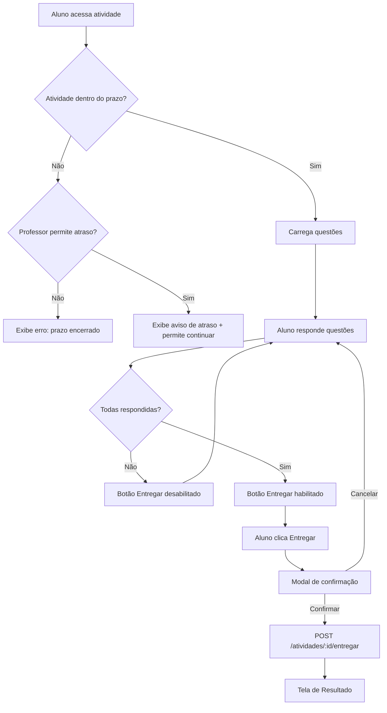

# Spec 03 — Área do Aluno

> **Macro funcionalidade:** Feed de conteúdos, realização de provas/atividades e acompanhamento pessoal  
> **Perfis envolvidos:** Aluno  
> **Plataforma:** Mobile-first (PWA)

---

## Telas desta Spec

1. [Feed de Conteúdos](#tela-feed-de-conteúdos)
2. [Leitura de Material](#tela-leitura-de-material)
3. [Flashcards](#tela-flashcards)
4. [Lista de Atividades e Provas](#tela-lista-de-atividades)
5. [Realização de Atividade](#tela-realização-de-atividade)
6. [Realização de Prova (com timer)](#tela-realização-de-prova)
7. [Resultado e Feedback](#tela-resultado-e-feedback)
8. [Meu Desempenho](#tela-meu-desempenho)

---

## Tela: Feed de Conteúdos

> **Rota:** `/aluno/feed`  
> **Autenticação:** Requerida  
> **Perfis com acesso:** Aluno

### Contexto

Tela inicial do aluno após o login. Exibe conteúdos, atividades e provas organizados por relevância e urgência.

### Layout e Componentes

**Header:**
- Avatar e nome do aluno
- Ícone de notificações com badge de contagem
- Pontos acumulados (gamificação) — exibido de forma discreta

**Seção "Urgente" (se houver):**
- Cards destacados em amarelo/vermelho: provas ou atividades com prazo em menos de 24h

**Seção "Para fazer":**
- Cards de atividades e provas disponíveis, ordenados por prazo
- Card contém: título, disciplina, tipo (prova/atividade), prazo, status (não iniciado/em andamento)

**Seção "Novos conteúdos":**
- Cards de materiais publicados pelos professores
- Card contém: título, disciplina, tipo (texto/vídeo/PDF), tempo estimado de leitura

**Seção "Recomendados pela IA":**
- Conteúdos sugeridos com base em desempenho recente
- Badge "Sugerido para você" com breve explicação: "Você teve dificuldade em frações — veja este material"

**Barra de navegação inferior (mobile):**
- Feed | Atividades | Desempenho | Perfil

### Estados da Tela

| Estado | Descrição |
|--------|-----------|
| **Carregando** | Skeleton cards |
| **Sem pendências** | Mensagem motivacional + histórico de conteúdos |
| **Com urgências** | Seção de urgência destacada no topo |

### Chamadas de API

| Método | Endpoint | Resposta esperada |
|--------|----------|-------------------|
| GET | /aluno/feed | { urgentes[], paraMaker[], conteudos[], recomendados[] } |

---

## Tela: Realização de Atividade

> **Rota:** `/aluno/atividades/:id`  
> **Autenticação:** Requerida  
> **Perfis com acesso:** Aluno matriculado na turma

### Contexto

Aluno iniciou ou está continuando uma atividade. Diferente da prova, não há timer obrigatório e o aluno pode salvar rascunho e voltar depois.

### Layout e Componentes

- **Header:** Título da atividade, disciplina, prazo
- **Progresso:** Barra de progresso "Questão X de Y"
- **Área da questão:** Enunciado + opções (se múltipla escolha) ou textarea (se dissertativa)
- **Navegação:** Botões "Anterior" e "Próxima"
- **Botão "Salvar Rascunho"** — persiste respostas sem submeter
- **Botão "Entregar"** — disponível apenas quando todas as questões foram respondidas

### Comportamentos Esperados

- Rascunho é salvo automaticamente a cada 30 segundos (autosave silencioso)
- Aluno pode navegar livremente entre questões
- Após entregar: exibir feedback imediato se o professor configurou gabarito automático
- Entrega após o prazo: exibir aviso "Este prazo já encerrou" — se o professor permitiu entrega atrasada, entregar com marcação; se não, botão desabilitado
- Upload de arquivo para questões dissertativas (PDF, imagem, máx 5MB)

### Fluxo de Submissão

### Chamadas de API

| Método | Endpoint | Dados | Resposta |
|--------|----------|-------|----------|
| GET | /atividades/:id | — | { titulo, questoes[], prazo, statusAluno } |
| PUT | /atividades/:id/rascunho | { respostas[] } | 200 OK |
| POST | /atividades/:id/entregar | { respostas[] } | { entregaId, feedback? } |

---

## Tela: Realização de Prova (com timer)

> **Rota:** `/aluno/provas/:id`  
> **Autenticação:** Requerida

### Diferenças críticas em relação à Atividade

- **Timer visível** no header — countdown regressivo
- **Sem rascunho manual** — autosave a cada 60 segundos (silencioso)
- **Navegação bloqueada** — sair da tela exibe modal de aviso "Sua prova está em andamento. O timer continua correndo."
- **Entrega automática** quando o timer chega a zero
- **Não pode voltar** após entregar

### Comportamentos de Segurança da Prova

- Questões embaralhadas por aluno (se o professor configurou)
- Alternativas embaralhadas por aluno (se o professor configurou)
- Ao detectar saída de aba/janela (visibilitychange): registrar evento no log (sem penalidade automática — professor decide)
- Em mobile: detectar screenshot não é possível — registrar duração fora do app

### Estados Críticos

| Estado | Descrição | Comportamento |
|--------|-----------|---------------|
| **Timer < 5 minutos** | Urgência | Timer muda para vermelho, vibração (mobile) |
| **Timer = 0** | Expirado | Submissão automática com o que foi respondido |
| **Conexão perdida** | Offline | Banner de aviso; respostas em localStorage temporário; reconexão tenta sync |
| **Sessão expirada** | Token venceu | Renovação automática via refresh — aluno não deve ser interrompido |

### Chamadas de API

| Método | Endpoint | Dados | Resposta |
|--------|----------|-------|----------|
| POST | /provas/:id/iniciar | — | { sessaoId, questoes[], duracao, iniciadaEm } |
| PUT | /provas/:id/sessoes/:sessaoId/autosave | { respostas[] } | 200 OK |
| POST | /provas/:id/sessoes/:sessaoId/entregar | { respostas[] } | { entregaId } |

---

## Tela: Resultado e Feedback

> **Rota:** `/aluno/avaliacoes/:entregaId/resultado`  
> **Autenticação:** Requerida

### Layout — Quando gabarito está disponível

- **Nota e média da turma** — destaque visual
- **Gabarito por questão:**
  - Múltipla escolha: mostra resposta do aluno (✅ certa / ❌ errada) e a alternativa correta
  - Dissertativa: mostra resposta do aluno e "Aguardando correção do professor" (ou nota manual se já corrigida)
- **Análise da IA:** "Você errou 4 questões sobre frações. Que tal revisar este material?" — com link para conteúdo

### Layout — Quando gabarito não está disponível

- Confirmação de entrega
- "O professor irá liberar o gabarito em breve."

---

## Tela: Meu Desempenho

> **Rota:** `/aluno/desempenho`  
> **Autenticação:** Requerida

### Layout e Componentes

- **Resumo geral:** Média global | Total de atividades entregues | % de frequência
- **Por disciplina:** Cards com média, tendência (↑↓) e próxima avaliação
- **Gráfico de evolução:** Linha do tempo de notas por disciplina (seletor de disciplina)
- **Conquistas:** Badges de gamificação ("Streak de 7 dias", "Top 3 da turma", "Sem faltas no mês")
- **Flashcards sugeridos:** Atalho para revisar tópicos com menor acerto

### Chamadas de API

| Método | Endpoint | Resposta esperada |
|--------|----------|-------------------|
| GET | /aluno/desempenho | { resumo, disciplinas[], evolucao[], conquistas[] } |

---

## Tela: Flashcards

> **Rota:** `/aluno/flashcards`  
> **Autenticação:** Requerida

### Contexto

IA gera flashcards de revisão com base nos conteúdos publicados pelos professores e nas dificuldades identificadas.

### Layout e Componentes

- **Seletor de disciplina e tópico**
- **Card frontal:** Pergunta
- **Animação de virada:** Toque/clique revela a resposta
- **Avaliação pós-resposta:** Botões "Sabia" | "Não sabia" — usados para priorizar revisão (algoritmo de repetição espaçada)
- **Progresso:** "X de Y cards revisados"

### Comportamento

- Flashcards marcados "não sabia" voltam ao deck com maior frequência
- Sessão de flashcards pode ser encerrada a qualquer momento com progresso salvo
- IA gera novos flashcards semanalmente com base em novos conteúdos

### Chamadas de API

| Método | Endpoint | Dados | Resposta |
|--------|----------|-------|----------|
| GET | /aluno/flashcards?disciplina=:id | — | { cards[] } |
| POST | /aluno/flashcards/:cardId/avaliacao | { resultado: "sabia" \| "nao_sabia" } | 200 OK |
| POST | /ia/gerar-flashcards | { conteudoId } | { cards[] } |

---

## Regras de Negócio — Área do Aluno

- Aluno só vê atividades e provas das turmas nas quais está matriculado
- Prova iniciada não pode ser reiniciada — apenas continuada na mesma sessão
- Se o aluno fechar a prova sem entregar, ao reabrir o timer continua a partir do tempo que parou (o tempo corre mesmo com a aba fechada)
- Nota de provas com questões dissertativas só fica disponível após correção manual pelo professor
- Gamificação: pontos são ganhos por entregar atividades no prazo, acessar conteúdos e performance em provas
