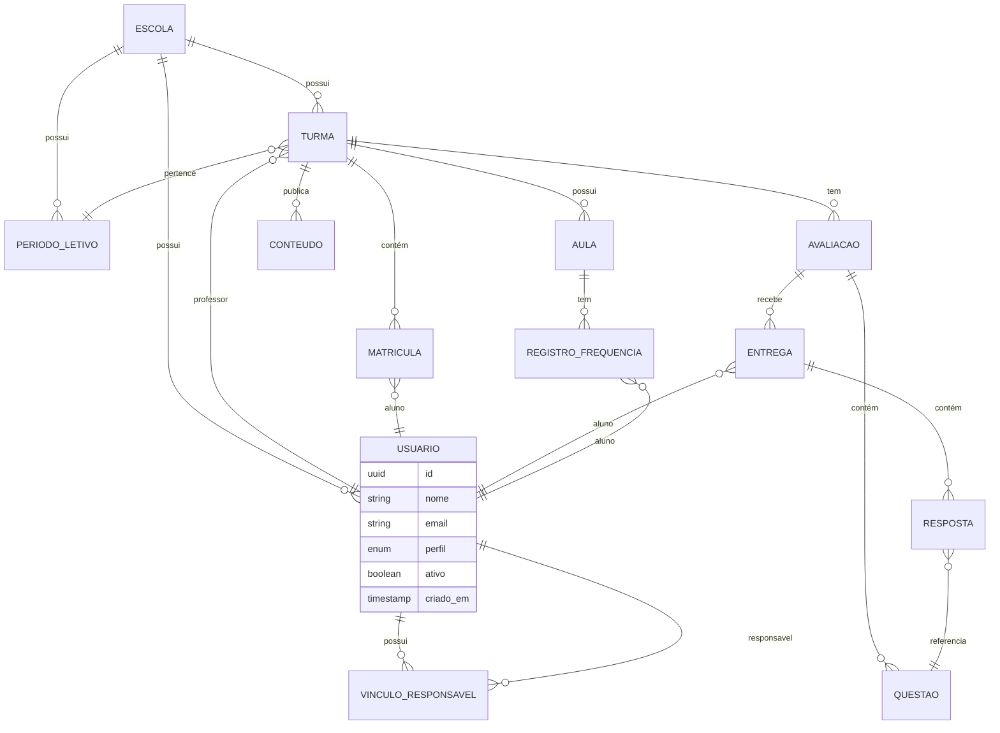

# Spec 06 — Modelos de Dados

> **Macro funcionalidade:** Schemas e relacionamentos do banco de dados  
> **Audience:** Backend, DBA, Arquitetos

---

## Diagrama de Relacionamentos (ERD)

---

## Schemas Detalhados

### Tabela: `escolas`

| Coluna | Tipo | Constraints | Descrição |
|--------|------|-------------|-----------|
| id | UUID | PK | — |
| nome | VARCHAR(200) | NOT NULL | Nome da escola |
| cnpj | VARCHAR(14) | UNIQUE | CNPJ sem formatação |
| logo_url | TEXT | NULLABLE | URL da logo no storage |
| nota_minima_aprovacao | DECIMAL(3,1) | DEFAULT 5.0 | Configurável |
| frequencia_minima_aprovacao | DECIMAL(5,2) | DEFAULT 75.0 | % mínimo |
| sistema_avaliacao | ENUM | NOT NULL | bimestral/trimestral/semestral |
| criado_em | TIMESTAMPTZ | NOT NULL | — |
| atualizado_em | TIMESTAMPTZ | NOT NULL | — |

---

### Tabela: `usuarios`

| Coluna | Tipo | Constraints | Descrição |
|--------|------|-------------|-----------|
| id | UUID | PK | — |
| escola_id | UUID | FK → escolas | — |
| nome | VARCHAR(200) | NOT NULL | — |
| email | VARCHAR(320) | UNIQUE | — |
| senha_hash | TEXT | NULLABLE | Null se usa SSO |
| perfil | ENUM | NOT NULL | professor/aluno/responsavel/coordenador/admin |
| ativo | BOOLEAN | DEFAULT true | Soft enable/disable |
| avatar_url | TEXT | NULLABLE | — |
| criado_em | TIMESTAMPTZ | NOT NULL | — |
| ultimo_acesso | TIMESTAMPTZ | NULLABLE | — |

**Índices:**
- `email` (UNIQUE)
- `escola_id, perfil` (filtragem comum)

---

### Tabela: `vinculos_responsavel`

| Coluna | Tipo | Constraints | Descrição |
|--------|------|-------------|-----------|
| id | UUID | PK | — |
| responsavel_id | UUID | FK → usuarios | — |
| aluno_id | UUID | FK → usuarios | — |
| parentesco | VARCHAR(50) | NULLABLE | "pai", "mãe", "avó", etc. |
| criado_em | TIMESTAMPTZ | NOT NULL | — |

**Constraints:**
- UNIQUE(responsavel_id, aluno_id)

---

### Tabela: `periodos_letivos`

| Coluna | Tipo | Constraints | Descrição |
|--------|------|-------------|-----------|
| id | UUID | PK | — |
| escola_id | UUID | FK → escolas | — |
| nome | VARCHAR(100) | NOT NULL | Ex: "2025 — 1º Semestre" |
| inicio | DATE | NOT NULL | — |
| fim | DATE | NOT NULL | — |
| ativo | BOOLEAN | DEFAULT false | Apenas 1 ativo por escola |

---

### Tabela: `turmas`

| Coluna | Tipo | Constraints | Descrição |
|--------|------|-------------|-----------|
| id | UUID | PK | — |
| escola_id | UUID | FK → escolas | — |
| periodo_letivo_id | UUID | FK → periodos_letivos | — |
| professor_id | UUID | FK → usuarios | — |
| nome | VARCHAR(200) | NOT NULL | Ex: "9º Ano A" |
| serie | VARCHAR(50) | NOT NULL | Ex: "9º Ano" |
| disciplina | VARCHAR(100) | NOT NULL | — |
| deletado_em | TIMESTAMPTZ | NULLABLE | Soft delete |

---

### Tabela: `matriculas`

| Coluna | Tipo | Constraints | Descrição |
|--------|------|-------------|-----------|
| id | UUID | PK | — |
| turma_id | UUID | FK → turmas | — |
| aluno_id | UUID | FK → usuarios | — |
| matriculado_em | TIMESTAMPTZ | NOT NULL | — |
| removido_em | TIMESTAMPTZ | NULLABLE | Soft delete |

**Constraints:**
- UNIQUE(turma_id, aluno_id) — mesmo aluno não pode estar 2x na mesma turma

---

### Tabela: `avaliacoes` (provas e atividades)

| Coluna | Tipo | Constraints | Descrição |
|--------|------|-------------|-----------|
| id | UUID | PK | — |
| turma_id | UUID | FK → turmas | — |
| professor_id | UUID | FK → usuarios | — |
| titulo | VARCHAR(200) | NOT NULL | — |
| tipo | ENUM | NOT NULL | prova/atividade |
| status | ENUM | NOT NULL | rascunho/agendada/publicada/encerrada |
| peso_nota | DECIMAL(3,1) | NULLABLE | 0 a 10 |
| duracao_minutos | INTEGER | NULLABLE | Só para provas |
| disponivel_em | TIMESTAMPTZ | NULLABLE | Agendamento |
| encerra_em | TIMESTAMPTZ | NULLABLE | — |
| embaralhar_questoes | BOOLEAN | DEFAULT false | — |
| embaralhar_alternativas | BOOLEAN | DEFAULT false | — |
| gabarito_liberacao | ENUM | NOT NULL | imediato/apos_prazo/manual |
| permite_entrega_atrasada | BOOLEAN | DEFAULT false | — |
| gerado_por_ia | BOOLEAN | DEFAULT false | Rastreabilidade |
| criado_em | TIMESTAMPTZ | NOT NULL | — |

---

### Tabela: `questoes`

| Coluna | Tipo | Constraints | Descrição |
|--------|------|-------------|-----------|
| id | UUID | PK | — |
| avaliacao_id | UUID | FK → avaliacoes | — |
| ordem | INTEGER | NOT NULL | Posição na prova |
| tipo | ENUM | NOT NULL | multipla_escolha/vf/dissertativa/correspondencia |
| enunciado | TEXT | NOT NULL | — |
| alternativas | JSONB | NULLABLE | [{ texto, correta }] |
| gabarito_dissertativo | TEXT | NULLABLE | Critérios de correção |
| dificuldade | ENUM | NULLABLE | facil/medio/dificil |
| topico | VARCHAR(200) | NULLABLE | Para mapa de calor |
| pontos | DECIMAL(4,2) | DEFAULT 1.0 | Peso da questão |

---

### Tabela: `entregas`

| Coluna | Tipo | Constraints | Descrição |
|--------|------|-------------|-----------|
| id | UUID | PK | — |
| avaliacao_id | UUID | FK → avaliacoes | — |
| aluno_id | UUID | FK → usuarios | — |
| status | ENUM | NOT NULL | rascunho/entregue/corrigida |
| iniciado_em | TIMESTAMPTZ | NOT NULL | — |
| entregue_em | TIMESTAMPTZ | NULLABLE | — |
| nota_automatica | DECIMAL(4,2) | NULLABLE | Calculada após entrega |
| nota_final | DECIMAL(4,2) | NULLABLE | Após correção manual |
| entrega_atrasada | BOOLEAN | DEFAULT false | — |

**Constraints:**
- UNIQUE(avaliacao_id, aluno_id) — uma entrega por aluno por avaliação

---

### Tabela: `respostas`

| Coluna | Tipo | Constraints | Descrição |
|--------|------|-------------|-----------|
| id | UUID | PK | — |
| entrega_id | UUID | FK → entregas | — |
| questao_id | UUID | FK → questoes | — |
| resposta_indice | INTEGER | NULLABLE | Para múltipla escolha (índice da alternativa) |
| resposta_texto | TEXT | NULLABLE | Para dissertativas |
| arquivo_url | TEXT | NULLABLE | Para dissertativas com upload |
| correta | BOOLEAN | NULLABLE | Calculado automaticamente para obj. |
| nota_manual | DECIMAL(4,2) | NULLABLE | Para dissertativas corrigidas pelo professor |

---

### Tabela: `registros_frequencia`

| Coluna | Tipo | Constraints | Descrição |
|--------|------|-------------|-----------|
| id | UUID | PK | — |
| turma_id | UUID | FK → turmas | — |
| aluno_id | UUID | FK → usuarios | — |
| data_aula | DATE | NOT NULL | — |
| status | ENUM | NOT NULL | presente/falta/falta_justificada |
| observacao | TEXT | NULLABLE | — |
| lancado_por | UUID | FK → usuarios | Professor que lançou |
| lancado_em | TIMESTAMPTZ | NOT NULL | — |
| editado_em | TIMESTAMPTZ | NULLABLE | — |

**Constraints:**
- UNIQUE(turma_id, aluno_id, data_aula)

---

### Tabela: `conteudos`

| Coluna | Tipo | Constraints | Descrição |
|--------|------|-------------|-----------|
| id | UUID | PK | — |
| turma_id | UUID | FK → turmas | — |
| professor_id | UUID | FK → usuarios | — |
| titulo | VARCHAR(200) | NOT NULL | — |
| tipo | ENUM | NOT NULL | texto/pdf/video/link |
| corpo | TEXT | NULLABLE | Para tipo texto (markdown) |
| arquivo_url | TEXT | NULLABLE | Para PDF |
| video_url | TEXT | NULLABLE | Para vídeo |
| link_externo | TEXT | NULLABLE | — |
| publicado_em | TIMESTAMPTZ | NULLABLE | Null = rascunho |
| serie_sugerida | VARCHAR(50) | NULLABLE | Para sugestões por série |
| topicos | TEXT[] | NULLABLE | Para categorização |

---

### Tabela: `flashcards`

| Coluna | Tipo | Constraints | Descrição |
|--------|------|-------------|-----------|
| id | UUID | PK | — |
| conteudo_id | UUID | FK → conteudos | NULLABLE (pode ser gerado sem vínculo) |
| turma_id | UUID | FK → turmas | NULLABLE |
| pergunta | TEXT | NOT NULL | — |
| resposta | TEXT | NOT NULL | — |
| gerado_por_ia | BOOLEAN | DEFAULT true | — |
| criado_em | TIMESTAMPTZ | NOT NULL | — |

---

### Tabela: `progresso_flashcards`

| Coluna | Tipo | Constraints | Descrição |
|--------|------|-------------|-----------|
| id | UUID | PK | — |
| aluno_id | UUID | FK → usuarios | — |
| flashcard_id | UUID | FK → flashcards | — |
| resultado | ENUM | NOT NULL | sabia/nao_sabia |
| revisado_em | TIMESTAMPTZ | NOT NULL | — |
| proxima_revisao | TIMESTAMPTZ | NOT NULL | Algoritmo de repetição espaçada |

---

### Tabela: `logs_auditoria`

| Coluna | Tipo | Constraints | Descrição |
|--------|------|-------------|-----------|
| id | UUID | PK | — |
| escola_id | UUID | FK → escolas | — |
| usuario_id | UUID | FK → usuarios | — |
| acao | VARCHAR(100) | NOT NULL | Ex: "ALUNO_REMOVIDO_TURMA" |
| entidade | VARCHAR(50) | NOT NULL | Ex: "matriculas" |
| entidade_id | UUID | NOT NULL | — |
| dados_anteriores | JSONB | NULLABLE | Estado antes da ação |
| motivo | TEXT | NULLABLE | Para ações destrutivas |
| ip | INET | NULLABLE | — |
| criado_em | TIMESTAMPTZ | NOT NULL | — |

**Notas:**
- Tabela append-only — nunca atualizar ou deletar registros
- Retenção mínima: 5 anos (LGPD)
